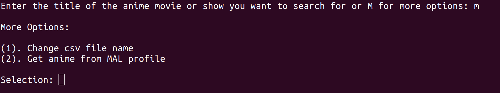

# Command Line MAL
Inspired by https://github.com/Bryce-Tucker/Command-Line-IMDB

### Demo

### Required Python Modules
Requires two third party modules:

1. **requests** : A module for sending HTTP/1.1 requests using Python.

2. **beautifulsoup4** : A module for parsing HTML and XML documents.

### Using The Program

Once the modules are installed, enter the directory which contains the scripts in the terminal. The name of the show or movie can be searched either just running the program and then inputing the name or or the name follows the program as a command line argument.

---
`python3 main.py Black Clover`

or

`python3 main.py`  
`Enter the title of the anime movie or show you want to search for: Black Clover`

---
When a search title has been provided, the program will output the number of results on MyAnimeList.net for that title, and then give a numbered list containing the first 5 results. The user can then select from a result from the list by entering the corresponding number, request the next 5 results by entering m, or exit by hitting enter. The user is able to keep requesting more results until every result has been displayed.

Once a result has been selected by the user, the program will output the title, rating, number of episodes, when the show aired, synopsis, and related anime. Then it will ask if the user would like to add this title to a CSV file.

### CSV Capabilities
Can make a new CSV file or append to an existing file. The first time one uses the program, it asks for the name of the CSV file, including the .csv extension, to which one would like to append. Every other time the program asks if the user would like to append to the file, the program knows the name of the file. The CSV file holds the information that is displayed in the output, and it is ordered alphabetically by title of show or movie. If a title already exists in the CSV file, then it will update that row. The file is located on one's Desktop.

To edit the name of the file to which one wants to append, it can be done when the program is initially run by pressing 'm'.

### Coming Soon
TBD what new features will be added.